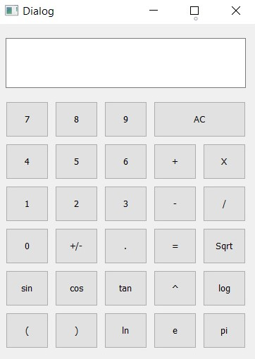

 

 

[![KWoC 2018](https://img.shields.io/badge/KWoC-2018-0078D6.svg?style=for-the-badge&longCache=true&logo=)](https://kwoc.kossiitkgp.org/)

# PyQt Calculator
This is a basic PyQt based scientific calculator.

## Prerequisite:

### Linux based OS or Windows

* SIP

* PyQt4

* Qt Designer (Only for developers for editing layouts)

### MacOS

* Homebrew (to install dependencies easily).

* SIP

* PyQt4

* Qt Designer (Only for developers for editing layouts)

## Instructions to Run:

* Before you can build PyQt4 you must have already built and installed [SIP](https://pypi.org/project/SIP/) .

* You need to install PyQt4 dependency which can be installed on Linux based OS as `sudo apt-get install python-qt4.`
  For MacOS Run `brew install cartr/qt4/pyqt` on homebrew & finally add it to the python path.
  For Windows download wheel file from [here](https://www.lfd.uci.edu/~gohlke/pythonlibs/#pyqt4) & Then 
  locate the download file directory & Run `pip install .\pyqt4-file-name.whl` in command prompt or powershell.

NOTE: 'pyqt-file-name' should be replaced by the name of wheel file you've downloaded!

* Run `logic.py` for running the calculator. This contains the basic evaluation code and the logic behind the calculator.

* `calculator.ui` is the UI design used which can be created by PyQt Designer GUI. For UI modification you can install PyQt designer which can be installed for linux based OS as given [here](https://askubuntu.com/questions/763877/how-to-install-and-run-qt-designer-for-python). For windows or MacOS download it from [here](https://www.qt.io/download) .

* `calculator.py` is extract code of the UI using PyQt.

* Any `input.ui` file can be converted to `output.py` by `pyuic4 input.ui -o output.py` for pyqt4 dependencies.

* You can also go through these set of videos for understanding the framework and functioning of qt designer. Click [here](https://www.youtube.com/watch?v=iDJlGV8Rvgg).

* Here is the Layout of our scientific calculator!
  
  

## Support:

For any queries, please raise an issue or contact github@taapas1128.
